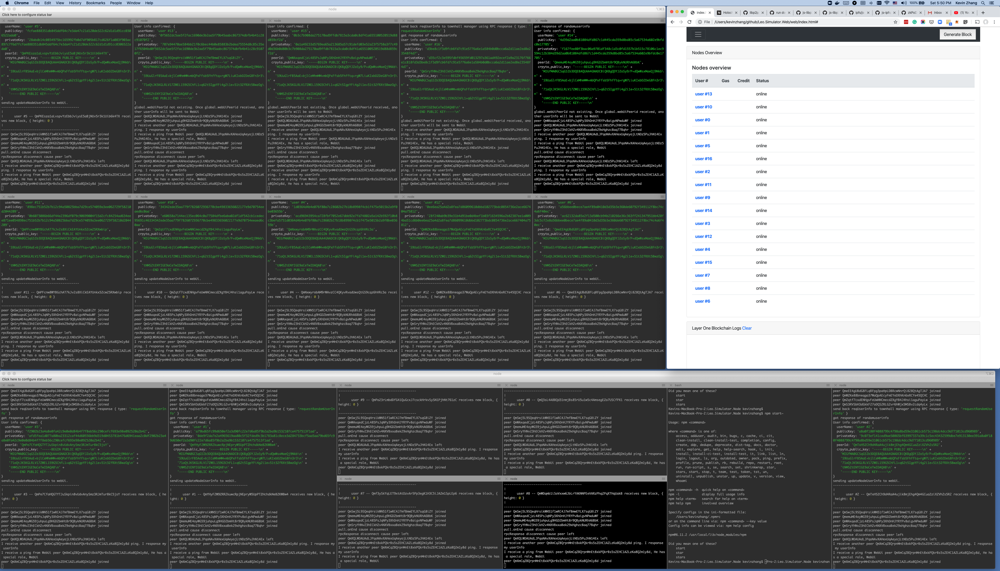

# Documents

# What, Why and How? about Leo

Leo project is a layer 2 solution on top of Elastos,which is the existing layer 1 blockchain. It provides a trusted subset of existing Elastos Carrier P2P network. Only hardware (TPM) attested node can join the network and provide trusted computing service to clients. Leo, the token, is used in this community like "gas" to Ethereum. Leo node owners provide trusted computation services in reward of Leo and a credit score called "credit". The "credit" acts like the "stake" in PoS based consensus. However, credit is not currency. It cannot be traded or purchased. The only way to gain credit is to work honestly for long period of time.

Please read the presentation slides by following this [link](./presentations/Blockchain_and_TrustedComputing_Apr2019.md): The presentation was made at The World Bank Group in Apr 2019.

The reasons we need such a trusted computing network lay on the following facts:
* Blockchain can offer us trustless decentralized platforms. However, blockchain cannot handle real computation. Anything that needs some kind of "real' computation cannot be ran on blockchain. We have to consider run off-the-chain.
* As long as the computation happpens off the chain, the consensus of blockchain will no longer protect the computation. The computing environment is no longer trustable. 
* If the computing tasks include sensitive privacy data and/or copyrighted information,the only thing you can do is to trust the computing machine is secure and owner is honest. Unfortunately that is not always the case.
* If we have a technical solution that guarantees the execution environment is exactly what the execution node advertise and whole computing process is under seamless remote attestation by unpreditable inspectors (or monitors), we do not have to trust nodes and nodes' owners. We just trust the consensus among all nodes. This is the essence of the blockchain consensus: "I do not have to trust anyone, but the consensus". This consensus is the core of Leo. This is why we havd the Leo project started in 2019.

# [Run the demo](./demo-doc/demo201909)
Currently we have developed a simulator to explain the concept. This is just a simulator, not a real product. The goal of the demo is to use some real life examples to show how the consensus was made and why it is "technically" trustable while the nodes who run your data are trustless.


## Do not want get hands dirty? watch the video

TO-DO:
Or, click [here for the detail step by step with screen captures](./demo-doc/demo201909): 
## Ready to get hands dirty? Let's run the code on your own


### Environment

At this moment (Sep 2019), the demo code is written in Node.js. At the time you read this document, we probably have migrate some of the module from Node.js to Rust. ([here is the reason why we start with Node.js than Rust](./demo-doc/reasons_to_started_with_nodejs.md)). Please make sure when you check out the code from github, always go to the branch demo201909 for all three repos. We will have a release tag some days later.

What you will need:
* A Mac or Linux machine, or A set of Raspberry Pi (at least 5 units in case you do not have a PC/Mac)
* We have not tested in Windows, but it should work as well.
* Install Node.js and Docker in your machine / or Raspberry Pi.
* In this demo, you do not have to install any blockchain client yet, since we actually did not use any blockchain. Everything is simulator.

### Clone the source code

We have three repos on github.
They are:

#### Blockchain (Layer One) Simulator 
Repo: [https://github.com/elastos/Leo.Simulator.Layer1](https://github.com/elastos/Leo.Simulator.Layer1)

This is the simulator of a blockchain. For example Elastos eth side chain. In this demo, all gas and credit settlement are done in smart contract on the layer one blockchain. In the real world, there will be samrt contract of blockchain. 

#### Node Simulator
Repo: [https://github.com/elastos/Leo.Simulator.Node](https://github.com/elastos/Leo.Simulator.Node)

This is the simulator of trusted computing node. It can be run on a Raspberry Pi with TPM installed. In the simulator, the code can be run in any Node.js VM. Therefore, you should run at least 10 instances in 10 terminals to simulate 10 nodes. If you machine is powerful enough, I would suggest you to run more than 20 nodes simutanously. 

#### Web UI
Repo: [https://github.com/elastos/Leo.Simulator.Web](https://github.com/elastos/Leo.Simulator.Web)
This is not a web server. It is just a index.html file with some js. It doesn't need any web server to host. You just open the local index.html in any web browser. 

Please `git clone`  each repo, and make sure you `git checkout demo201909` so that you choose the correct branch. 

Go to each repo and read the README.md file on how to setup and run the code. 
LayerOne [readme](https://github.com/elastos/Leo.Simulator.Layer1/README.md)
Node [readme](https://github.com/elastos/Leo.Simulator.Node/README.md)
WebUI [readme](https://github.com/elastos/Leo.Simulator.Web/README.md)

Before you run the demo, make sure you run this docker image if you have some difficulties access to the public internet (For example, you are in China). This docker image will run a local p2p swarm server so that all your nodes can communicate locally without access global p2p swarm servers /dns4/ws-star.discovery.libp2p.io/tcp/443/wss/p2p-websocket-star
```bash
docker pull libp2p/websocket-star-rendezvous:release
docker run -d -p 9090:9090 --name rendezvous libp2p/websocket-star-rendezvous:release
```
BTW, To disable prometheus metrics run the server with -e DISABLE_METRICS=1

# Demo user case
Here is a story:
Alice has a sensitive private picture. She wants someone to help her turn the picture from color to black and white. She doesn't have  image software or doesn't know how to use image processing software. There are some online service providers who can do that, however Alice has to upload her picture to cloud provided by service provider on which Alice doesn't trust. She is afraid of diclosure of her private picture since she has no control once the picture is uploaded on the internet. 

Bob is a software developer. He developed a algorithm to turn a color image into black & white one. Typically he can upload his code to a web server and provide such service to make money. He did not take this approach because he realized many clients do not trust him or the web server and they are not willing to upload their private pictures. Some clients ask Bob if he can send them the code so that they can run the algorithm in their own computer. Bob doesn't like this idea because he is afraid of disclosure of his code, thus no one will pay him for processing pictures. Bob is looking for a pure decentralized trusted computing platform so that he or anyone else , even the owner of the node running the process, cannot steal private images. This is how Leo can do for Bob and Alice. 

Click [HERE](./demo201909/1.0.Preparation.md) to see the how to prepare and run the demo yourself.



## Step 1 Bob: Offer decentralized image processing service on Leo
First, Bob needs to encrypt his code and upload to the Leo platform as a Lambda Transaction. In this transaction, Bob provides the price model "Pay per use" at the price of $Leo 3. Because Bob uploads his code in encrypted format, no one can decrypt unless Bob gives him the secure key. In this case, Bob is safe. 
Bob also provides a hash of the docker image which can run his code. Bob's code is written in Python. He just needs to find a standard Python docker image which can be find in dockerhub anywhere. 


Next, Bob needs to do some advertisement so that potential customers will know the hash of his paid service. 

Click [HERE](./demo201909/1.UploadImageProcessService.md) to see the demo in detail.

## Step 2 Alice: Offer an image processing task to Leo
Alice found Bob's offer. Alice doesn't trust Bob, but Alice trusts the Leo platform. Alice uses her client to encrypt her private picture then upload it to Leo as a new transaction. In this transaction she claims to use Bob's service (mentioned his service hash), and the requirement of pravacy: such as 1) The executor or monitor has to have a credit score 100 or above. 2)For executor's node, no network connection during process, clean up all cache, tmp file and trace after processing, make sure leave no trace. And the last not least, her offer: she is willing to pay $10 for this task.

## Step 3 VRF Select execution group members
Once Alice's transaction is broacasted to the Leo network, any node who meets the criteria can run a VRF function to determin if he is lucky enough to bid this task. Based on the default configuation ( or Alice can have a special config), there are 10 nodes passed the VRF and become "members of execution group". Because of the randomness of VRF, the number sometimes could be a little higher or lower than 10, but it doens't matter. 

## Step 4 Members of execution group run consensus to vote the leader - AKA Executor
The members of execution group will connect to each other using P2P communication channel, exchange their "random value with proof of VRF" and "voting power" - so called "J" value. The highest J value ( if J equals, the lower random value) will be the leader of the group, or so called "executor". Other members as long as passed the VRF and get verified would become monitors. Executor is the one who actually run the image process, as well as monitors are those node who do not run the process, but doing remote attestation before, during and after execution's process. All of them will get rewarded after the task is done unless they lie. If they did lie, there would be a penalty instead.

## Step 5 Executor and monitors provide proof to Alice and Bob's nodes, asking for secure keys
Alice and Bob will receive executor's request for secure key. Before they can send the secure key back to executor, they will need to verify the executor's proof of VRF and other monitors' confirmations. Thus they are confident that this executor is actually the real executor and its execution environment meet the requriement. The secure key itself will be RSA encrypted using executor's public key so that only executor can unlock it.

## Step 6 Executor receive secure key and decrypt the code and data in the trusted environment and execute
Executor receives and decrypts secure key. Use this secure key he can unlock both code and image data only inside the trusted execution environment (docker). This is guaranteed by the remote attestation from monitors.

After the execution, the result (the black & white image) is sent to Alice with the encrypted key RSA by Alice's public key. Only Alice can unlock the image. 

Once the task is done, the executor will clean up the docker image, all tmp files and memory trace. Monitors will confirm this by doing remote attestation using TPM. All of the monitors will sign the confirmation and send to layer one blockchain. Executor sends the payment request to layer one blockchain too.

## Step 7 Settlement
Layer one blockchain receive all the confirmations from monitors and payment request from the executor. Smart contract is triggered to calculate the reward and/or penalty. The current distribution is this: Alice paid Leo $10. $1 burn as gas fee. Bob gets $3 (as he offerred his algorithm at $5 per use). The rest $6 will be distributed to the exeuction group. The exeuctor gets 50%, which is $3. Other 9 monitors share another 50%, which is $0.33 per monitor.

The new balance will be included in the next block. 

# 
