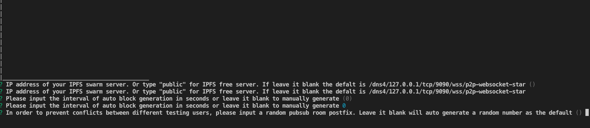
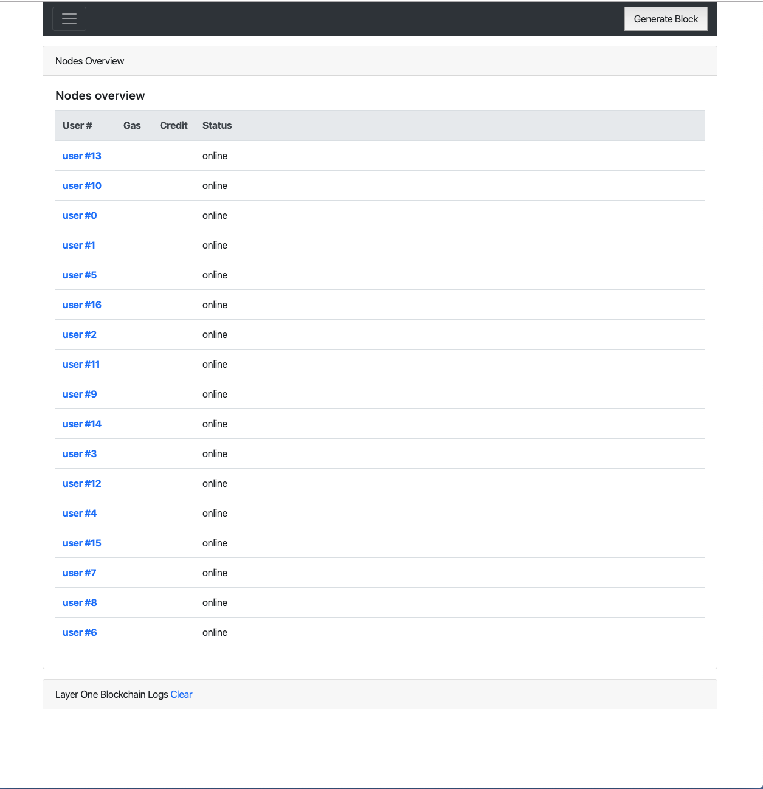
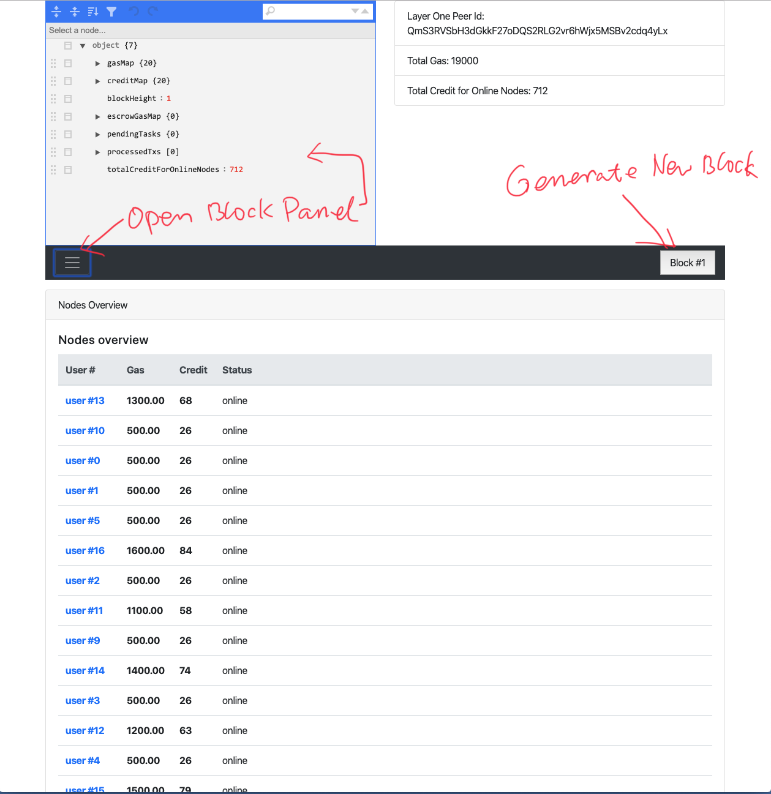

# Repos location

There are 3 repos you will need to clone to 3 different folders. They are WebUi, Node and LayerOne

They are:

* Blockchain (Layer One) Simulator 
Repo: [https://github.com/elastos/Leo.Simulator.Layer1](https://github.com/elastos/Leo.Simulator.Layer1)

This is the simulator of a blockchain. For example Elastos eth side chain. In this demo, all gas and credit settlement are done in the smart contract in the layer one blockchain. In the real world, this will be the samrt contract of blockchain. 

* Node Simulator
Repo: [https://github.com/elastos/Leo.Simulator.Node](https://github.com/elastos/Leo.Simulator.Node)

This is the simulator of trusted computing node. It can be running on a Raspberry Pi with TPM installed. In the simulator, the code can be run in any Node.js VM. So you should run at least 10 instances in 10 terminals to simulate 10 nodes. If you machine is powerful enough, I would suggest you to run more than 20 nodes simutanously. 

* Web UI
Repo: [https://github.com/elastos/Leo.Simulator.Web](https://github.com/elastos/Leo.Simulator.Web)

This is not a web server. It is just a index.html file with some js. It doesn't need any web server to host. You just open the local index.html in any web browser. 

# Install Node.js, NPM, Docker 
If you have not installed node.js, docker or NPM, please install them before continue. 
Reference links:
- https://www.nodejs.org
- https://docker.com
- https://www.npmjs.com/get-npm
# Clone code from github, install dependencies

```bash
# Create demo folder
mkdir demo201909
cd demo201909
git clone https://github.com/elastos/Leo.Simulator.Layer1
git clone https://github.com/elastos/Leo.Simulator.Node
git clone https://github.com/elastos/Leo.Simulator.Web

# checkout demo201909 branch and install dependencies
cd  Leo.Simulator.Layer1
git checkout demo201909
npm install
cd ..
cd Leo.Simulator.Node
git checkout demo201909
npm install
cd ..
cd Leo.Simulator.Web
git checkout demo201909
npm install

```

# Install local ipfs swarm server. 
Before you can run the demo, make sure you run this docker image if you have some difficulties to access the public internet (For example, in China). This docker image will run a local p2p swarm server so that all your nodes can communicate locally without access global p2p swarm servers /dns4/
ws-star.discovery.libp2p.io/tcp/443/wss/p2p-websocket-star

You can skip this step if you have no trouble access internet freely. You can use public free swarm servers.

```bash
docker pull libp2p/websocket-star-rendezvous:release
docker run -d -p 9090:9090 --name rendezvous libp2p/websocket-star-rendezvous:release
```
BTW, To disable prometheus metrics run the server with -e DISABLE_METRICS=1

# Open at least 10 terminal windows 
Because we are going to simulate many nodes simultanously. I would suggest you can run at least 10 nodes each in separated terminal window. If your computer can afford, ideally you should run 15+ nodes so that you can have some like-real experiences during the demo.

Make sure the terminal are tiled on your big screen so that you can see their logs. If you do not have a big screen, it is still OK, since most important messages will be shown on the web page. 

Please take a look on what I run this demo on my mac:


# Run Layer One Blockchain simulator
In one of the terminal window, run 
``` bash
cd Leo.Simulator.Layer1
npm start
```
This is the layer one blockchain simulator.

You will be asked three questions:



First question is about where is your ipfs swarm. If you installed and run the local ipfs swarm docker, you can just press 'Enter'. If you would like to use IPFS free public server, just type "public". Or if you have a swarm server running in a specific IP address, please type that IP address here, such as "10.1.1.9".

Second question is about the interval of generating new block. I would suggestion you just "Enter" to leave it by set it to "manual generate" so that you can have enough time to check what happened when new block comes, then click "new block" button on the web UI to proceed to new block. If you want the blockchain to automatically proceed new block, type in a number (in seconds). For example "10" means new block will be generated every 10 seconds.

Last question is asking for a pubsub channel name postfix. If you are running in public swarm and do not want other tester interfering your test, you can type a random number so that your pubsub channel will be different than others.

After those three questions, your layer one simulator will start

# Run Web UI
Open a web browser window. Drag and drop the <Your path>/Leo.Simulator.Web/web/index.html file to the browser. You will see the Web UI. Please note, we do not use http(s). There is no web server in our system. Everything is decentralized running on a Peer to peer manner. 

# Run the nodes
Go to each remaining terminal window. 
``` bash
cd Leo.Simulator.Node
npm start
```

# Check nodes status in Web Ui
If everything goes smoothly. Every node will get its test user name from layer one and contact WebUI to report its online status like this picture:


The sequence of the nodes has no meaning, they are just the sequence those nodes report its online status to WebUi peer. 

Right now, we do not have any block yet, so the "Gas", "Credit" column are empty.

# Generate a new block and check block content

Click the "Generate BlocK' button. After less than one second, you should see new block is broadcasted and UI updated like this:



You can expend the block panel by clicking the sandwich button shown in the picture.

You can see the content of new block, and each  node's gas / credit balance.

If you can see this, your installation and configuation are correct. Let's move on to the demo steps.

