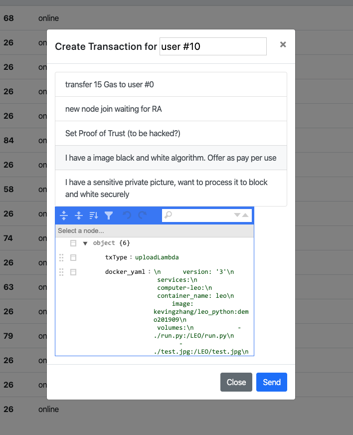

# Bob prepare image processing service
Let's quickly recap our use case.

Alice has a picture, Bob has an image processing service. They do not trust each other. Alice doesn't want to send her picture to Bob due to the concern of data breach. Bob doesn't want to give his code to Alice to run on Alice's computer because he is also concerned about his code would get released to public. They do not trust any cloud services either due to the same reason. Before Leo project, there is no easy solution (we discussed HE and MPC in other thread.)

In Leo project, Bob can test his algorithm Python code in a python docker image to make sure it can take an image as input and output the result in another image file. 

Bob generates the docker image and commit to github. In our case, the docker image is: kevingzhang/leo_python:demo201909 

Bob tested the docker-compose.yaml file (as shown below). This docker image just simply a standard python environment. It runs /LEO/run.py, take the /LEO/test.jpg as parameter. Turn this jpg file from color image to black & white. 

``` yaml

version: '3'
services:
  computer-leo:
    container_name: leo
    image: kevingzhang/leo_python:demo201909
    volumes:
      - ./run.py:/LEO/run.py
      - ./test.jpg:/LEO/test.jpg
    command: python run.py
  
```

# Bob commit his image processing offer to Leo network.
Bob creates a new transaction. See the picture below


In our demo, User #10 is Bob's user name.
There are canned transaction for easy testing. Bob clicks "I have an image black and white algorithm. Offer as pay per use" button. A pre-defined message is shown in the JSON editor. 
If you want to modify anything, just go ahead and modify the JSON code in the JSON editor. For example, you want to run MyNewAlgorithm.py, just modify the run.py line.

There is a property "amt" not shown in the screen capture. That is the price Bob offered "pay per use". In our test, the number is 4. That means, whoever wants to use this algorithm will pay Bob 4 ELA tokens per use. 

After clicking send. The transaction is commited to layer one block chain. We can see the log in the Web Ui.


Sorry for the typo in the image. I will fix it so you won't see it when you run this demo.

Please pay attention to the hash. You need copy this hash. You also need it in the next step when Alice commit her transaction, she will use this hash to refer Bob's image processing service.

This transaction will be posted in the next block.
