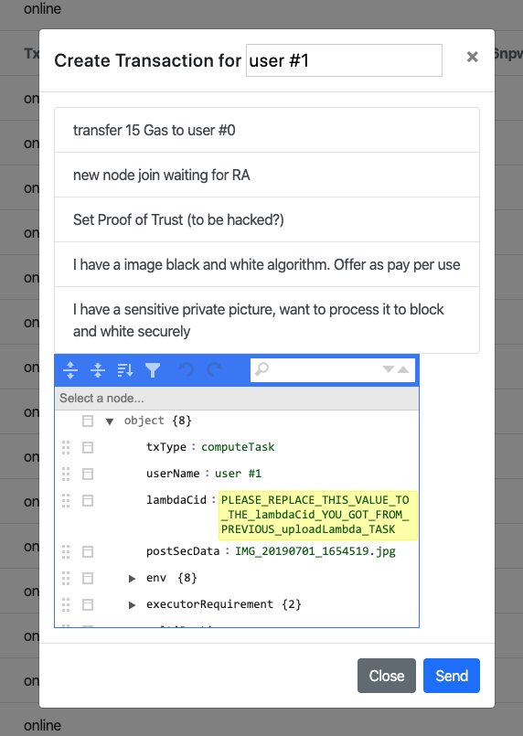

# Prepare original image
Alice put her picture in a local folder which her Leo node can access. In our test case, she put the image under /demo-data folder. 

The file name is IMG_28190701_1654519.JPG

Alice open WebUi and click the canned task "I have a sensitive private picture and want to process it to black & white picture securely".



Please take a look at the lambdaCid. The hash needs to be replaced by the hash Bob uploaded in his last step.

After paste Bob's image processing service hash, the UI looks like this:


There are other properties on Alice's task. Please also take a look although most of them are placeholders.
```js
{
  txType:"computeTask",
  userName,
  lambdaCid:"PLEASE_REPLACE_THIS_VALUE_TO_THE_lambdaCid_YOU_GOT_FROM_PREVIOUS_uploadLambda_TASK",
  postSecData:'IMG_20190701_1654519.jpg',
  env:{
    network:'totalIsolated',
    ipAllowed:'none',
    p2pTrafficInAllowed:'owner',
    resultSendBackTo:'owner',
    errorSendBackTo:'owner',
    osRequirement:"none",
    timeOut:'100',
    cleanUpAfter:'totalWipeout'
  },
  executorRequirement:{
    credit:3,
    deposit:10

  },
  multiParties:'none',
  depositAmt:10
});
```
Alice can request an executor must have 3 credit score or higher. The image processing has to be executed while network totally isolated. Alice will pay 10 ELA token for this task. The executor needs to deposit 10 ELA token to work on her task. 

# Layer One put Alice's task into next block


Alice commit her computing task. Layer one has a new log saying "the computing task is pushed into pending task".

Now press new block button, we can see new block come out with this new task included.


In the pendingTasks property, you can see the new computing task Cid which means this task is an ongoing active task. In the escrowGasMap property, you can see Alice has paid her deposit 10 ELA. You can also see Alice's gas balance is now 490 (it was 500 in last block). The 10 ELA token goes to the escrow account. This also causes the total Gas turns to 18990 (it was 19000).

In our next step, all online nodes will run their VRF to compete Alice's task.
