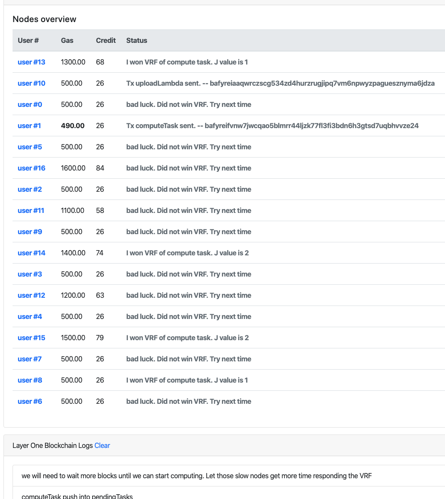
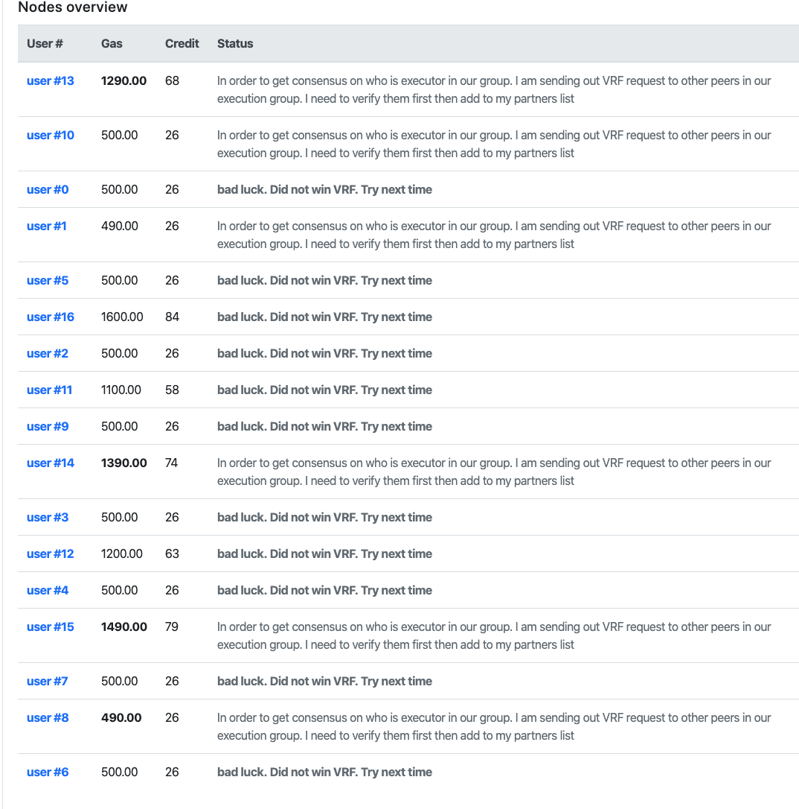
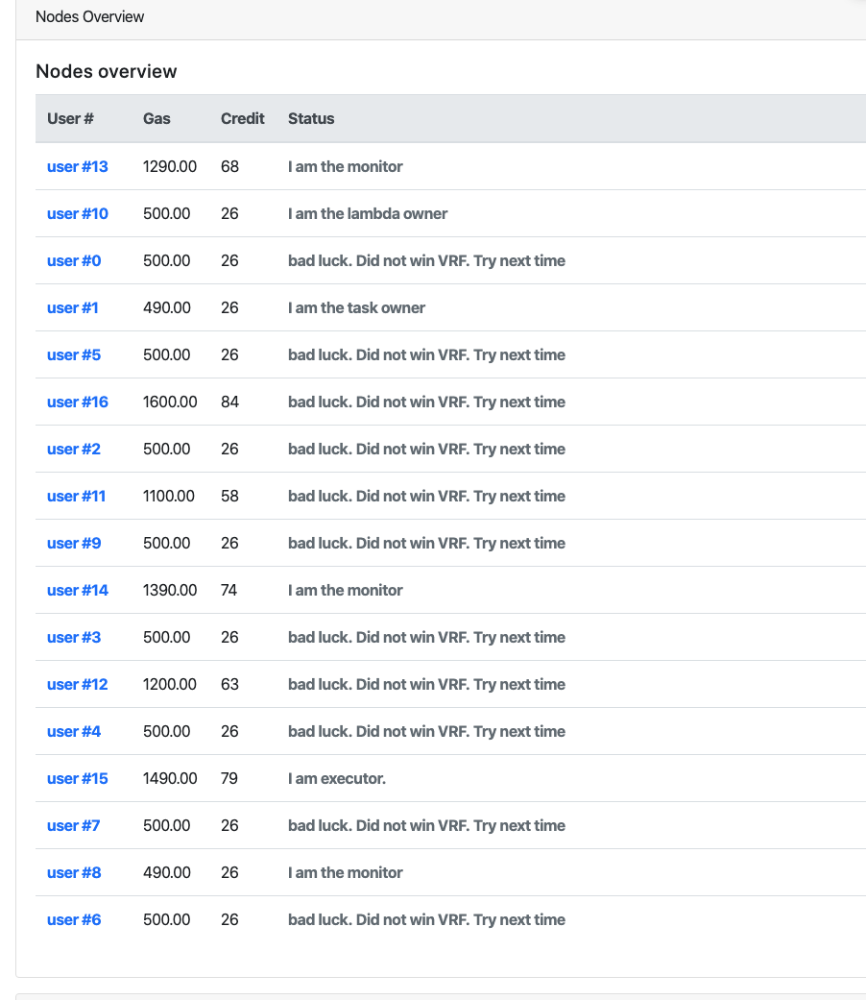

# Online nodes run VRF to compete for execution group members
In our last step, Alice committed a computing task to have her image processed with an offer of 10 LEO. 
Once this task included in new block is broadcasted to the network, all online nodes can compete to win the 10 LEO. This is called VRF compete.

A few seconds after the task is broadcast, we can see some nodes win competition some are not lucky enough.

The winer also claimed a J value. The J value means voting power in the winner group. As long as the J value > 0, this node has been approved to join the execution group. However, only one of members act as executor, others are monitors. In next block, everyone in the execution group will run a consensus among each other to vote for the executor. 

[About VRF ](https://en.wikipedia.org/wiki/Verifiable_random_function)
>In cryptography, the concept of a verifiable random function (VRF) was introduced by Micali, Rabin, and Vadhan.[1] It is a pseudo-random function that provides publicly verifiable proof of its outputs' correctness. Given an input value x, the owner of the secret key SK can compute the function value y = FSK(x) and the proof pSK(x). Using the proof and the public key {\displaystyle PK=g^{SK}}PK=g^{{SK}}, everyone can check that the value y = FSK(x) was indeed computed correctly, yet this information cannot be used to find the secret key.

VRF plays a very important role in our Leo project. It is the base of our consensus. We do not run the energy consuming Proof of Work consensus, especially on our target IoT devices. VRF can provide security yet light weight. The library we are using is the javascript implmenet of Algorand by [@Pingy520](https://github.com/pinqy520). [Github](https://github.com/pinqy520/vrf.js)

For those unlucky nodes, they are simply out of the game. Only the winners continue to run into the consensus part next.

# Consensus among execution group members, voting for executor
In fact, this is not a voting. It is a comparison among each execution group member. All of them will need to agree on who the executor is. Based on our consensus algorithm, the executior must have the highest J value. If there are two or more candidates have the same J value, the lower random value (from VRF) wins. 

Now let's click the next block. you should see the following web UI

Please note that all the winners in our last step has lost 10 LEO in their gas balance. In fact, this is not a "lost", it is a deposit. Our consensus require everyone who wants to join the execution group pay deposit ( the same amount as the task owner Alice requests).

You can see many status message fly around for all execution group members nodes. They are contacting all other members in the same group, exchange their VRF to find who will be the executor.

After a few seconds, you can see the status become stable. This means all of the nodes have got consensus among each other. 

We can see the result here:

You can see user #15 is the executor. Other members are monitors.

You can find more detail information from each node's log in their terminal window.

In our next block, the executor will start to work on the compute task while other monitors are doing remote attestation on the executor.
 

