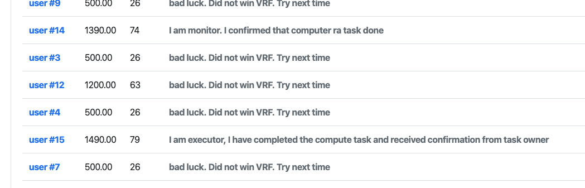

# Alice and Bob verify executor's proof of executor
Alice, as the owner of the compute task, and Bob, as the owner of image processing algorhtm (so called Lambda), are not  members of execution group, but they are involved in the conesensus we mentioned in last step. So they know who eventually become the executor and who are monitors.

Both Alice and Bob hold their own crypto keys to unlock their private image and lambda code. Without those keys, no one could unlock the code and image. Before Alice and Bob safely send the key to the executor, they will need to confirm 2 things
* Only give keys to the executor, no one else
* Need majority of monitors to agree that the executor has the trusted execution environment, and their code and data is running inside the execution environment (This feature to be implmeented)

# Executor prepare the docker environment and receive encrypted keys
Based on what Bob described in the image processing service transaction, the execution will be running inside a pre-created docker. So the executor will download the run the docker in executor's memory. 

The docker is just an execution environment, Executor still need code to run and data to load. At this moment, when the execution environment is ready, monitors will make a remote attestation (BTW, this is not a on-time test, the remote attestation is a continue process from the beginning to the end)

Once monitors get the confirmation of executor's environment, they will send the confirmation to Alice and Bob. Alice and Bob will verify those confirmation and the ID of executor. if they are satisfied, they will give the encrypt key to executor. All the communication between any node is encrypted using RSA.

# Executor run the code on data
Once executor received the encrypt keys from Alice and Bob, he can start restore the python code and image file to the folder where Bob's docker requried. In our test case, it is the folder of docker, the file names are run.py and test.jpg.

Executor run the docker. Since the algorthm is pretty simple, it will complete within one second. The result is the file called result.jpg.

Executor encrypt the result.jpg with an random key, then send the random key to Alice.

# Executor clean up environment and wait for confimation from monitors

The computation is complete but it doesn't mean the compute task is complete. Executor need to make sure everything is cleaned up, no trace left. 

Executor stop docker. remove docker container and image. remove all volumn of tmp files it may use during execution. The volumn is supposed to be the same as what it was before execution. 

The technical detail on how the monitors can test the clean up will be discussed in a separated topic. 

When the monitors see the whole environment is reset , no trace left, they will sign a transaction to layer one blockchain as a confirmation. 

 

