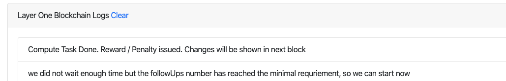
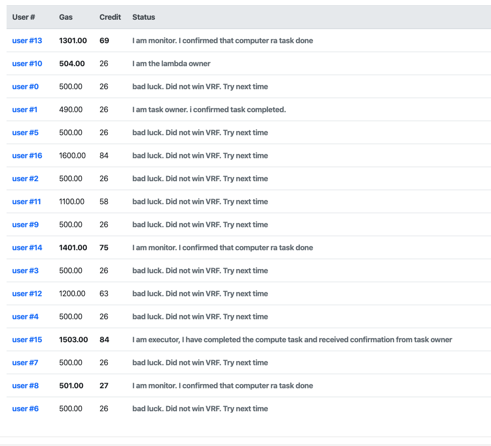
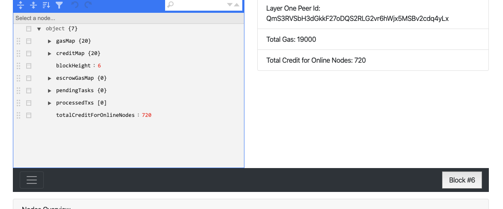

# Layer one blockchain collects all signed confirmation from monitors and task owner

Continue from last step. Monitors and task owners received remote attestation and task result, they will send confirmation to layer one blockchain. 
For task owner, Alice, she need to get the key to unlock the result.jpg (TODO: Under implmentation). For the monitors, they will need to sign their confirmation to receive the commision (reward)

Once layer one received majority of the monitor's confirmation (large enough to run a settlement), it will start settlement. 

# Settlement algorithm

There are several steps

## Confirm that there was a consensus from monitors
Layer one smart contract need to make sure there was a consensus between execution group members. They need to agree on 
* Who is the executor
* Executor has done the task
* Executor has done the task under the requirement of the task, especially on security requirements.

The consensus is based the weighted vote of execution group members. The weight is the J value and credit. (TODO: implmeneting weighted vote)

Any monitor can vote Agree or Disagree based on their own remote attestation result. They won't know others result so there is no way to follow majority. 

Once the weighted vote result is out. All monitors voted the same as the result are winners. others are losers.

## Distribute reward Gas

If the result determine the executor has not done a good job, or there is no consensus on who the executor is, then the claim executor and loser monitors will lose his deposit, and a credit penalty. Those monitors who tell the truth will share the claim executor's deposit. Alice will get her deposit back but she did not get her picture processed. She can try again later. No matter what the result is, Bob will get the payment for using his code first. So Bob will receive $LEO 4 from total escrow remaining.

If the result determine the executor did great job. Layer one block chain will send key to Alice, so that Alice can use the key to unlock the result.jpg. If there are loser monitors, their deposit will be put into the escrow pool and shared by winners and executors. For winner monitors and executor, they will first get back their deposit, then share the remaining of escrow pool for this task. Based on current definition, the executor will win 50% of total reward, other winner monitors share the rest 50%.
## Gas to layer one blockchain
Layer one blockchain won't share the reward with other nodes, but all transaction need a gas, like tax in real world. So whoever receive reward will need to share the gas fee.
## Credit reward
All honest nodes (executor, monitor) will receive a credit reward as well.
## Credit normalization not inflation
There is no credit inflation in LEO system, however there is a normalization. That means new rewarded credit comes from the shrink of all credit owners. The total credit score won't change for every block, but thsoe who did not get reward credit will have a little shrink (same thing as dilute, just total credit won't change)
## Change state and show in next block
Once layer one blockchain made the settlement, the change on gas will be in next block.

## See the change in new block
Now, click the next block.
you will see the changes in gas

Also, in the new block, you will see the pending task has been reset. That means this task is completed.

# Mission acomplishied!

Here we go! We have completed a basic image processing task. Let's review what we learned so far in our last step
