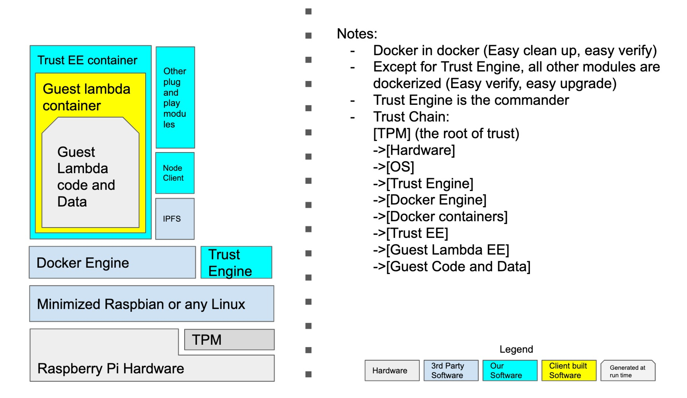

# Some principles in our design
When we take a look at the diagram of node client here

You will see some of the modules are put into docker containers. Some are out of the docker and run on top of OS directly. The idea and principles are like this
| Features | Lower in tech stack | Higher in tech stack |
|---|---|---|
| Attack surface | Very little | relative large |
| Logic | General | Specific to domain knowledge |
| Frequent update | Uncommon | Likely |
| Programming language | Machine code or low level language | High level language |
| Hardware access | Direct | Indirect |
| Efficiency requirement | High | Low |
| Foot print | Small | Large |
|Security level requirement | High | Low |
| Trust dependency | Depends on TPM / Hardware | Depends on low level modules |

In this case, when I design the architect I prefer

- As long as a module doesn't need to be at low level, put them into a docker container so that we can easily upgrade on the fly, and the lower level "root of trust" can monitor and guarantee this model security

- If a model has to be at lower level, try our best to minimize it, not only the logic need to be minimized, but also only nessesary components installed. For example, we try to customize a Raspbian with minimized components. eg. we do not need the node to connect to keyboard, then remove the keyboard driver if possible. 

- Single contact point to fatal modules, such as only allow Trust Engine to talk to TPM. Other moddules are banned to contact TPM directly.

For those modules can be put into docker container, we can leverage Docker to implement the micro services concept
- All modules lose couple with other modules. 
- Every module can be upgraded individually
- Every module is responsible for the security of their internal logic. Leave Trust Engine and Docker Engine to take responsibility to control the docker image. Only download and load docker images passed blockchain verification.

_ 

## Raspberry Pi Hardware
We use RPi in our demo because it is a popular typical "maker's" hardware. There are existing commerical available TPM for RPi. Building TPM Chips is not our primary goal. We build consensus instead.

Once this model works, we can actually migrate to any platform. 

## Docker Engine

## Trust Engine
### Use Docker Remote API to control Docker Engine to load "clear" and "proof" docker image

### Connect to TPM directly

## gRPC and FFI

### General crypto API modeule. such as VRF to off load the work from those container.

Rather than using REST API which is slower, another way to call Rust module from Node.JS is using FFI
https://github.com/node-ffi/node-ffi

Example: https://medium.com/@atulanand94/using-rust-modules-for-javascript-web-development-part-3-3-nodejs-7c71e4ae23fe

We can use volumn to share the host folder to docker container. 

This solution also work when the dynamic library was written in C/C++. 

https://github.com/nodejs/node-gyp is also an alternative solution, but I have had some build error before. so I am hesitate to use.

### gRPC in general communication protocol between each modules
Besides the FFI mentioned in above section, gRPC can be used in most none-efficient-critical cases.
An example of gRPC between Rust and Node in my github repo : https://github.com/kevingzhang/tower-grpc

Compare with FFI, there are a few significant benefits
- Isolation in different process. FFI runs code in the caller's process. It is crash, the caller will crash. So we only use FFI in the extrame cases that the efficiency is so critical that we have to take the risk. And only if the called module is very mature with less chance to update. A few examples are VRF, Encryption/Decryption/ Hash etc. 

- Language independency. Since gRPC supports major programming languages, we can use different modules from different developers using their preferred programming languages. 

- Faster and secure by leveraging HTTP/2 and Protocol Buff

# Modules running in docker container

## IPFS

## Image2IPFS or IPDR

Dockerhut.com is a general docker image registry by default. But it is centralized and potential security concern. We can run a Image2IPFS or IPDR services to redirect all docker images from centralized registry to IPFS. These projects are

https://github.com/jvassev/image2ipfs/

https://github.com/miguelmota/ipdr

The benefits are

- Additional check on the images downloaded from IPFS. 
- Potential Pay-Per_use model depends on blockchain token-economy. Only paid user can get the key to unlock images
- Leo commitee can release "trusted" images so-called "white list". 
- Images can have its own "credit score" stored and maintained in blockchain
- Total decentralized

## Leo Node

## ELA Eth sidechain light node or full node if necessary

Sync to blockchain to get latest block. 

## Sandbox, the trust container to run guest task inside

For those guest task require total isolated network environment, we can use this sandbox as the middle layer. In this layer, we will create the guest container inside this container. The guest container is defined without network. But there is a shared volumn with this sand box. The shared volumn is the only I/O to the guest container. In this case, as long as we can guarantee the middle layer sandbox is totally detroyed without any trace left, we are sure the guest container has no trace left. 

Let's use the Sep2019 demo as an example. When Bob design the lambda, he design the container without network but only have a shared volumn with the host, actually not the host, but the middle layer sandbox. Because there is no network, Alice won't worry about Bob send her picture to somewhere else. 

The original picture will be downloaded and decrypted in the shared volumn. Bob's Python code processed the picture and save the output image on the shared volumn too. 

The sandbox encrypted the output image send back to Alice then destroy the whole sandbox , inluding the guest container inside. TPM controlled Trust Engine to validate the sandbox is clear, no trace left, then the remote attestators can sign the proof to Layer One.

