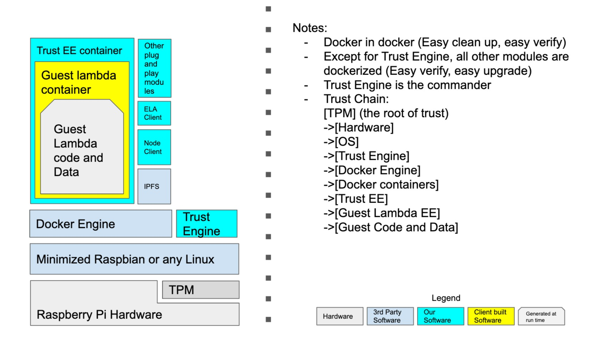

# Migrate Layer One Demo code from node.js to Elastos eth side chain

## Taskroom layer migrate to a node.js web3 bridge (Task 1.1)
Current node communicate to layerone using the TaskRoom's broadcast. We can simply rewrite the taskRoom implementation from a p2p pubsub room to a Web3 bridge. In this case, it is not necessary to rewrite other code

## Rewrite the logic of each message handler to Solidity (Task 1.2)
Current node.js implementation use message handler to modify global state then issue new block. All  these handlers need to be rewrite to solidity smart contract. 

## Assigning node's userName need to be removed from layerone  logic (Task 2.1)
Our current implementation has a feature to issue each node's userName. This is just a temporary solution when I am doing test in one machine, I do not want to deal with each simulator node's userName and pub/priv key persistent storage. However, in the real smart contract, we cannot do this in blockchain layer. We will need to modify the node so that the node will read its own userName and public/private  key from each node local storage. Once we get there, we will use each Raspberry Pi as test machine or docker, so key storage won't be an issue.

## WebUi will be removed from LayerOne (Task 2.2)
We currently have WebUi to show layerone's log. we will need to remove them from solidity. Everything can only be read from smart contract log or next block.

# Web UI project changes
## remove code connect to layer one (Task 3.1)
Since we will rewrite layerone to solidity, there won't be message channel between WebUi and solidity. Related code need to be removed

## Remove layer one log panel (Task 3.2)

## Listen to new block from regular eth light node (Task 3.3)
Currently we listen to new block from block pubsub room. This will be no longer available. So we will have a eth light node to feed new block to the WebUi project

## TownHall room remove logic connecting LayerOne (Task 3.4)

# Node run on RaspBerry Pie
## Dockerize current node.js client

## Move IPFS from js-ipfs instance to a standalone dockerized ipfs server. (Task 4.1)
Current implementation runs every IPFS instance inside each node.js process because I am running all of them in  one Mac. In the real case, we do not run all of them in one machine. So each of them will have its own instance. Each node instance can run its related ipfs  server in its machine (Raspberry Pi for  example).

The IPFS server also work as a public service not only to the node.js  client, but also to any other services in the future.

Once the dedicated IPFS server separated from original node.js client, we should wrap it into a standalone docker container with its own peerInfo (public,  private key storage).

### Current difficulties
- js IPFS has some features not exist in Go-IPFS implmentation, especially the libp2p part. We either find an alternative solution (rewrite lib p2p which is used by pubsub room), or give up using GO-IPFS implementation (back to j-IPFS). this is a question we need to discuss.
## Research on Docker In Docker technology
Docker In Docker means  we run a general isolate docker container to work as a network / storage isolator between the real execution environment (inside dodker) and outside world. Once we have such an middle layer, we can easily clean up all tmp storage and guarantee network isolation. 

# Raspberry Pi

## Minimized OS for Raspberry Pi  (Task 5.1)
We do not need too many features in RPi. We only need to run docker without any additional components. Even keyboard, display card drivers can be ignored in order to minimize the attack surface. So we can choose or even build ourselves a minimized version of RPi linux. We can start from exsting minmized RPi OS, try to reduce the size and components untill all remaining components are necessary to us.

### Conclusion for Dec 2019
We use Basibian minimized version for now. It is too risky to use Alpine due to missing toolchains.

## TPM module (Task 5.2)
This is the key part of our security system. We need a direct communication channel between our node client and TPM. There are two different TPM module available at this moment, we need to do some research or test to find which one is better in our use case. 

The TPM communication channel needs to 
* Read signed PCR from TPM
* Ask TPM's master key management system to help to manage our IPFS, DID key pair
* Ask TPM to verify network, harddrive status, make hash if needed. 

## Infrastructor on RPi
### gRPC framework between Rust, JS, Py (Task 5.2.1)
### Unix socket communication layer (Task 5.2.2)

## TPM modules
### Call to the hardware TPM (Task 5.3.1)
### Algorithm to determine if the system is trustable from TPM data (Task 5.3.2)
#### Put the algorithm into PY, or JS, or RS (Task 5.3.2.1)
#### Integrate the algorithm into node (Task 5.3.2.2)

## VRF microservice (Task 5.4)
### Support VRF in RUST microservice and unix domain socket communication (Server)  (Task 5.4.1)
### Replace existing sync js function package to unix domain socket RPC calls (Client) (Task 5.4.2)

## TPM protection to RPi and TPM itself (Task 5.5)
This is self protection for RPi and TPM itself.
Including
### LUK encryption to RPi boot area on SD card
### TPM physical lock
### Zymbit (if we finally choose to use Zymbit) binding to a specific RPi unit

We need to some security test for these features

## Docker in docker (Task 6.1)

# Rasbperry Pi System Setup (Task 7.0)
## Setup Init docker compose (Task 7.1)
## Setup Docker launcher security check (Task 7.1)
## Setup Docker launcher API exposed to other clients (Task 7.2)

# Pentest for RPi 

# Pentest for P2P network

# World Bank Use Case

